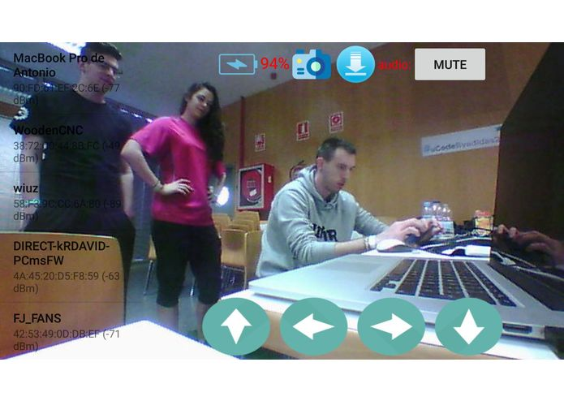
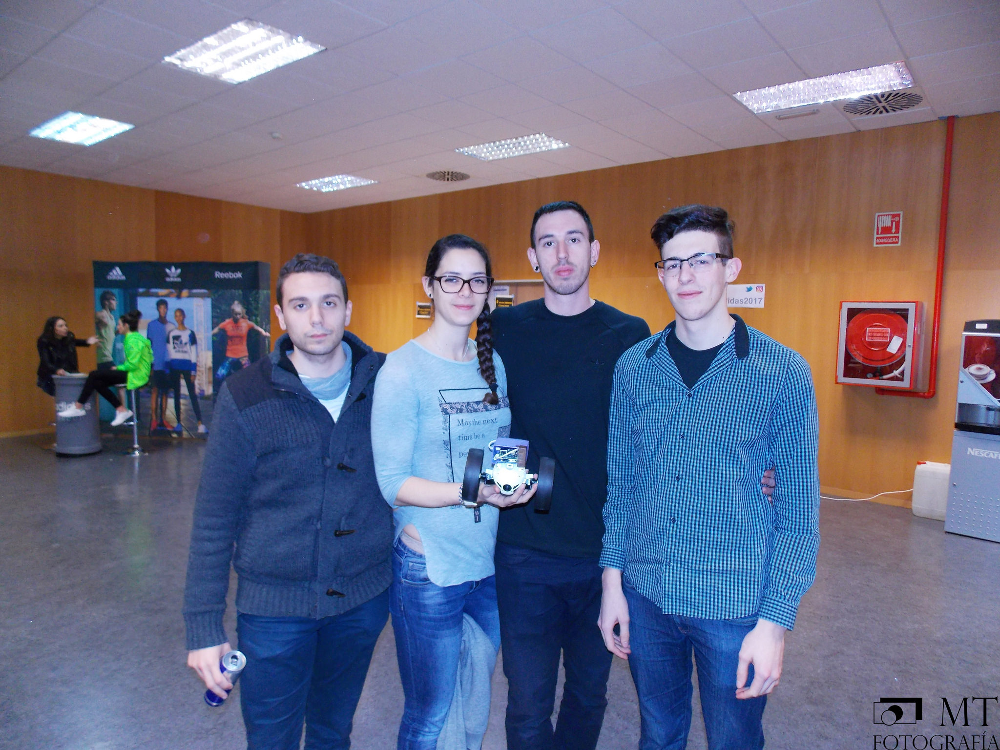

<h1>Report</h1>
<h2>Events and on-line courses</h2>
<h3>Current trends</h3>
 
<h4>Author</h4>
<b>David Lozano Jarque (NIU 1359958)</b>
 
Escola d'Enginyeria, Universitat Autònoma de Barcelona
Course 2016-2017

# Index
In the following table, there is the summary of events and courses (activities) that will be detailed in this report, providing its title, time spent on them and a reference to the page where the activity details start. The activities are sorted in chronologically ascending order. Use the links in the numbers to go to the activity report.

| Number | Title | Hours | Page |
| ---: | :--- | :---: | :---: |
| [1](#activity-1) | Barcelona Wolfram Hackathon | 10 | 2 |
| [2](#activity-2) | Software protection and commercialization | 4.5 | 4 |
| [3](#activity-3) | Deloitte: integration of a SSDLC methodology in project management | 1.5 | 6 |
| [4](#activity-4) | Mango: delivering value | 1.5 | 8 |
| [5](#activity-5) | Everis: agile methodologies in project management | 3 | 10 |
| [6](#activity-6) | Coursera.org: Bitcoin and cryptocurrencies technologies | 20 | 12|
| [7](#activity-7) | MSI Experience UAB | 4 | 14 |
| [8](#activity-8) | Barcelona Blockchain Winter Meetup | 3 | 16 |
| [9](#activity-9) | uCode EINA powered by Adidas | 25 | 18 |
| __Total__ | _9 activities (8 events &amp; 1 on-line course)_ | _72.5_ | _21_ |

# Activities
Along these pages, the activities (events and on-line courses) which I assisted during the academic course will be detailed providing the details about each activity beside an activity content summary, rating (using a [Likert scale](https://en.wikipedia.org/wiki/Likert_scale)) and review. Activities' attendance certificates will be attached at the end of this report.
## <a name="activity-1"> 1. Barcelona Wolfram Hackathon
### Details

| Date | Time | Place | Organization | Price | Website |
| :---: | :---: | :---: | :---: | :---: | :---: |
| 2016-09-17 | 09:30h (CEST) | [Barcelona Mobile World Centre](https://goo.gl/maps/tY9qv6HnQ6o) | [Wolfram: Computation Meets Knowledge](https://www.wolfram.com) | _Free_ | [https://goo.gl/VrKZ89](https://goo.gl/VrKZ89) |

### Summary
The activity started after registration and a short breakfast with the introduction by the organizer and Wolfram Europe Account Executive, Christopher Jordan to the _Wolfram_ company and its services, that are far more than the well known computing engine _Wolfram Alpha_.

After that, Bernat and Jofre Espigulé (twin brothers) who studied both at UAB and work together in the _Wolfram_ company, taught us how to use the [_Wolfram Language_](https://www.wolfram.com/language/) in their software [_Wolfram Mathematica_](https://www.wolfram.com/mathematica/), a closed-source proprietary software that ables the user to use the Wolfram Computing engine and its features (all kinds of mathematical calculus, machine learning and artificial intelligence functionalities among others like numerous data feeds) using the Wolfram Language in script-like files.

Once the explanation finished (1hr), we were given temporary licenses so that we could create a project that day using its software. After 8hr. approximately of thinking about a project to develop it and actually develop it, the projects were presented and two of them were awarded with prizes: its own software lifetime licenses.

### Review
Despite the potential of the software that Christopher Jordan exposed before the technical explanations of how to use it with the language, the explanation of Jofré and Bernat was poor as they didn't know how to transmit knowledge to the audience. They just passed over the on-line tutorial explaining punctual, unrelated things as they appeared on the screen, as if they had not prepared the presentation.

Our project was developed along with a team (Carlos González and Cristian Garcia also from UAB), and consisted in a very simple application that created a word cloud with the most used words by a Twitter user. Due to the bad explanations of the language, we had to loose time reading the language tutorials as the presentation did not really taught us anything. Furthermore, the language is very different from any programming language existing in syntax terms and also difficult to use.

To summarize, it was great to discover the Wolfram Mathematica software and its language Wolfram Language because of its potential but the bad explanation of the speakers and hard to use syntax of the language itself, made the hackathon a day to learn the language rather than a day to develop a cool and trendy project.
### Rating

| Question | Strongly disagree | Disagree | Neutral | Agree | Strongly agree |
| :---: | :---: | :---: | :---: | :---: | :---: |
| Fit my expectations | ⭐ | ⭐ | ⭐ |||
| Interesting content and approach | ⭐ | ⭐ | ⭐ |||
| Will be useful | ⭐ | ⭐ | ⭐ |||
| ___Global rating___ | __⭐⭐⭐__ | 6.5/10 |

## <a name="activity-2"> 2. Software protection and commercialization
### Details

| Date | Time | Place | Organization | Price | Website |
| :---: | :---: | :---: | :---: | :---: | :---: |
| 2016-12-01 | 10:30h (CET) | [Escola d'Enginyeria](https://goo.gl/maps/DaESrvtnoz72) | [Oficina de Valorització i Patents](http://www.uab.cat/web/serveis/valoritzacio-de-la-recerca-1345672826947.html) &amp; [Elzaburu](http://elzaburu.es/es/) | _Free_ | [https://goo.gl/daxrHa](https://goo.gl/daxrHa) |

### Summary
After presenting themselves, the lawyers of [Elzaburu](http://elzaburu.es/es/) explained to the audience how (proprietary) software can be protected and securely commercialized after it has been developed. Starting with the definition of what is legally an invention, the presentation showed the main points an invention must provide in order for it to be patentable.

After that, they focused on how this law applies to software, with examples such as [Amazon 1-click buy patent](http://www.businessinsider.com/amazons-patent-on-one-click-payments-to-expire-2017-1) and how this patents are relevant in order to protect proprietary software from being copied without permission. Also, the example demonstrated how patent laws are different in America and Europe and why this happens.

In a nutshell, the event provided the audience a great introduction of how patent laws work, starting with the definition of what can be patented and ending with technical details about those laws.

### Review
The event provided a great summary of how we can protect our software when commercializing it, not just the way we can do it, but also if we can do it using patents and if we should do it, while providing interesting details about patents and its related laws worldwide.

### Rating

| Question | Strongly disagree | Disagree | Neutral | Agree | Strongly agree |
| :---: | :---: | :---: | :---: | :---: | :---: |
| Fit my expectations | ⭐ | ⭐ | ⭐ | ⭐ ||
| Interesting content and approach | ⭐ | ⭐ | ⭐ | ⭐ | ⭐ |
| Will be useful | ⭐ | ⭐ | ⭐ | ⭐ ||
| ___Global rating___ | __⭐⭐⭐⭐__ | 8.5/10 |

## <a name="activity-3"> 3. Deloitte: integration of a SSDLC methodology in project management
### Details

| Date | Time | Place | Organization | Price | Website |
| :---: | :---: | :---: | :---: | :---: | :---: |
| 2016-12-16 | 09:00h (CET) | [Escola d'Enginyeria](https://goo.gl/maps/DaESrvtnoz72) | [Deloitte](https://www2.deloitte.com) | _Free_ | - |

### Summary
Two software engineers from _Deloitte_ introduced the audience about SSDLC: _Secure Software Development Cycles_. They started defining briefly what Software Development Cycles stand for and after that, presented situations in which some of them due to the fast development iterations, led to insecure software development because of the coding rush. To sum up, they presented a series of techniques, that _Microsoft_ recommended in what they call a [Security Development Cycle](https://www.microsoft.com/en-us/sdl/), paring each technique to a software development cycle that could cause security issues due to the hurries.
### Review
In spite of the big potential of those techniques to reduce the potential security vulnerabilities in software applications and libraries while keeping the development speed that development cycles offer, the presentation showed everything from a theoretical perspective. Therefore the speech, resulted in the presentation of great techniques that were not shown how they can be applied. Concisely, the presentation provided a great introduction to SSDLC, but the tools or means to apply them in real projects made the speech loose potential value.

### Rating

| Question | Strongly disagree | Disagree | Neutral | Agree | Strongly agree |
| :---: | :---: | :---: | :---: | :---: | :---: |
| Fit my expectations | ⭐ | ⭐ ||||
| Interesting content and approach | ⭐ | ⭐ | ⭐ |||
| Will be useful | ⭐ | ⭐ | ⭐ |||
| ___Global rating___ | __⭐⭐__ | 5/10 |

## <a name="activity-4"> 4. Mango: delivering value
### Details

| Date | Time | Place | Organization | Price | Website |
| :---: | :---: | :---: | :---: | :---: | :---: |
| 2016-12-16 | 10:30h (CET) | [Escola d'Enginyeria](https://goo.gl/maps/DaESrvtnoz72) | [Mango](http://shop.mango.com/iframe.faces?state=she_001_ES) | _Free_ | - |

### Summary
The speech was about how the _Mango_ fashion company used their website to sell fashion on-line and the importance of it by explaining their techniques for software development and team management. Initially, the speakers presented the company, some details about it and just after that, how their on-line store provided great value to its brand and revenue. From that moment forward, they used the importance of their on-line store to explain the importance of not just the appearance and UX but also the performance to provide customers a great shopping experience even in the most difficult moments such as Black Friday or Cybermonday. They also explained the technologies they used to achieve their success and why not just those technologies but a good team of valuable and skilled people were needed to accomplish it. Therefore they also explained how team management is important to develop great products and the things they learned from team management with all their experience in the field.

### Review
The presentation, rather than focusing on the brand or company, showed really practical and useful advices on how to develop great software. Not just focusing on the technology (where they provided specifically all of the technologies they used), but also on team management (where they also stated great guidance based on their practical knowledge). To sum up, one of the greatest speeches of software development I've assisted to, providing practical value on every aspect that involves creating a software, in this case, a web application.

### Rating

| Question | Strongly disagree | Disagree | Neutral | Agree | Strongly agree |
| :---: | :---: | :---: | :---: | :---: | :---: |
| Fit my expectations | ⭐ | ⭐ | ⭐ | ⭐ | ⭐ |
| Interesting content and approach | ⭐ | ⭐ | ⭐ | ⭐ | ⭐ |
| Will be useful | ⭐ | ⭐ | ⭐ | ⭐ | ⭐ |
| ___Global rating___ | __⭐⭐⭐⭐⭐__ | 9.75/10 |

##  5. Everis: agile methodologies in project management
### Details

| Date | Time | Place | Organization | Price | Website |
| :---: | :---: | :---: | :---: | :---: | :---: |
| 2016-12-19 | 10:30h (CET) | [Escola d'Enginyeria](https://goo.gl/maps/DaESrvtnoz72) | [Everis](https://www.everis.com/spain/es/home-spain) | _Free_ | - |

### Summary
Using a game, _Everis_ showed how agile methodologies are a good and simple to use way to develop projects with a team. They started defining the [KanBan methodology](https://kanbantool.com) and just after that, presented a game to simulate a project using a series of tasks that the project requires to be completed and a dice to simulate tasks working time. With this gamification experience, we were able to understand practically how the methodology works and why it's really useful.
### Review
The event provided a great and fun experience to learn the KanBan methodology not just with the typical slide presentation but also with a gamification of the knowledge that made the audience understand how it worked at a practical level. Not just the content was interesting but the way how it was exposed made the event provide real, useful and practical applicable knowledge.

### Rating

| Question | Strongly disagree | Disagree | Neutral | Agree | Strongly agree |
| :---: | :---: | :---: | :---: | :---: | :---: |
| Fit my expectations | ⭐ | ⭐ | ⭐ | ⭐ | ⭐ |
| Interesting content and approach | ⭐ | ⭐ | ⭐ | ⭐ | ⭐ |
| Will be useful | ⭐ | ⭐ | ⭐ | ⭐ | ⭐ |
| ___Global rating___ | __⭐⭐⭐⭐⭐__ | 9.75/10 |

##  6. Coursera.org: Bitcoin and cryptocurrencies technologies
### Details

| Date | Time | Place | Organization | Price | Website |
| :---: | :---: | :---: | :---: | :---: | :---: |
| 2016-11-28 | 00:00h (UTC) | (on-line) [Coursera](https://coursera.org)) | [University of Princeton](https://www.princeton.edu/) | _Free_ | [https://goo.gl/s4cW8Y](https://goo.gl/s4cW8Y) |

### Summary
This on-line course, provided by the _University of Princeton_, introduces us to the cryptocurrencies technologies, focusing in [Bitcoin](https://bitcoin.org) cryptocurrency. The course starts with an introduction to the base technologies that make cryptocurrencies possible, mainly cryptographical ones such as [hash functions](https://en.wikipedia.org/wiki/Hash_function) and [asymmetric cryptography](https://en.wikipedia.org/wiki/Asymmetric_crypto). After that, explains how this technologies combined with [blockchain technology](https://en.wikipedia.org/wiki/Blockchain) can make a cryptocurrency possible, avoiding the [double spend attack](https://en.wikipedia.org/wiki/Double-spending) and reaching a global worldwide consensus across all cryptocurrency users in the network (also called nodes). Once all technologies have been explained, explains at a high level how the Bitcoin is implemented. Eventually, the course finishes explaining political issues and other non-technical information about the cryptocurrency ecosystem like market exchanges (cryptocurrencies forex) and [mixing](https://en.bitcoin.it/wiki/Mixing_service).
### Review
The course provides a great introduction to cryptocurrencies at a general level for everyone with a basic understanding of computer science and cryptography. Then, focuses on how this technologies that make possible cryptocurrencies are applied in Bitcoin. The main pro of the course that is easy to understand for everyone makes that if you want to develop some project using Bitcoin, there is not enough detail level to start. I think some chapters should be introduced to focus on how Bitcoin works at a low level, as there's few information about it over the Internet. Despite that, all information (videos and texts), and deliverables is really well done and accomplishes the main goal: introducing a newbie into the Bitcoin and cryptocurrencies ecosystems.

### Rating

| Question | Strongly disagree | Disagree | Neutral | Agree | Strongly agree |
| :---: | :---: | :---: | :---: | :---: | :---: |
| Fit my expectations | ⭐ | ⭐ | ⭐ | ⭐ ||
| Interesting content and approach | ⭐ | ⭐ | ⭐ | ⭐ | ⭐ |
| Will be useful | ⭐ | ⭐ | ⭐ | ⭐ ||
| ___Global rating___ | __⭐⭐⭐⭐⭐__ | 9/10 |

##  7. MSI Experience UAB
### Details

| Date | Time | Place | Organization | Price | Website |
| :---: | :---: | :---: | :---: | :---: | :---: |
| 2017-02-16 | 16:00h (CET) | [Escola d'Enginyeria](https://goo.gl/maps/DaESrvtnoz72) | [MSI Spain](https://es.msi.com/) | _Free_ | [https://goo.gl/YWjHPr](https://goo.gl/YWjHPr) |

### Summary
The speech provided an introduction to the _MSI company_ and its impact in Spain, explaining the products they offered, why they are built that way, and the problems that appear while creating their hardware and what solutions do they apply to solve them. Despite the speakers being really talented as communicators, the speech didn't provide much knowledge, as it was focused on sponsoring the own company products and services versus the competence
### Review
In my opinion, the whole speech was a boringly large advertisement about all products MSI offered and why theirs where better than their competitors. Few details about the technology, the problems and solutions they applied when creating the hardware was explained and everything was extremely focused on selling their products rather than providing the audience some kind of useful knowledge. The worst event I assisted in the whole subject. Not because of the speakers (they made the whole speech really active, interacting with the audience), but because of the marketing-orientation of the whole speech. They even offered prizes to the people of the audience who better know what they're products are (best performance GPU model, product launch dates...). Because of this I think assisting to this activity should not be recommended in this subject anymore as does not offer any kind of knowledge about technology. Complete waste of time if you're not interested in MSI products.

### Rating

| Question | Strongly disagree | Disagree | Neutral | Agree | Strongly agree |
| :---: | :---: | :---: | :---: | :---: | :---: |
| Fit my expectations | ⭐ |||||
| Interesting content and approach | ⭐ |||||
| Will be useful | ⭐ |||||
| ___Global rating___ | __⭐__ | 1/10 |

##  8. Barcelona Blockchain Winter Meetup
### Details

| Date | Time | Place | Organization | Price | Website |
| :---: | :---: | :---: | :---: | :---: | :---: |
| 2017-02-20 | 10:30h (CET) | [Antiga Fàbrica Estrella Damm](https://goo.gl/maps/3GujmcU3kfE2) | [Barcelona Blockchain Meetup](https://www.meetup.com/es-ES/barcelonablockchain/) | _Free_ | [https://goo.gl/jHgUQu](https://goo.gl/jHgUQu) |

### Summary
This meetup, organized by Albert Castellana from the NEM foundation, consisted in the speech of several organizations that were developing [Blockchain technologies](https://en.wikipedia.org/wiki/Block_chain) related projects. The following speechs took place:
 - __[BECON Global](http://www.becon.global)__ presented itself as an organization that provided help to organizations who wanted to develop new blockchain products and also focused on spreading the word about blockchain technologies and its potential to encourage traditional organizations develop blockchain projects.
 - __[Blockchain & Sharing economy](https://www.linkedin.com/pulse/blockchain-sharing-economy-marc-rocas)__ explained why blockchain can be used in sharing economies, the new economy model to connect sellers and buyers providing trust without a third party.
 - __[uPort: Decentralized Identity for All](https://www.uport.me/)__ showed how they developed a blockchain to create a distributed and decentralized storage of identities intended for a global and secure use, as the way to use identities in the future in a universal and decentralized identity blockchain that could help to solve the problem not just of authentication but also universal identity storage.
 - __[Aragon: Create and manage companies on top of Ethereum](https://aragon.one)__ performed a demo about their [DApp (Distributed Application)](http://www.coindesk.com/information/what-is-a-decentralized-application-dapp/) that using a modern web UIX could manage an entire organization main processes using democratic processes and everything over the [Ethereum](https://ethereum.org) blockchain.
> Being one of the most interesting projects I've seen in all the subject events, I kept following this project development after the blockchain. And they have done really great improvements (https://goo.gl/Pt9wqC)
 - __[Status: Lowering Ethereum's Barriers to Entry](https://status.im)__ tried to introduce blockchain technologies to everyone by developing a mobile application that interacted with [Ethereum](https://ethereum.org) blockchain with a simple, modern and usable mobile user interface in their mobile application.

### Review
One of the most interesting talks I've assisted to, not just because the content, but also because the projects presented were really interesting and innovative. Also, that was one of the first events that were not just about one company but also presented several different and great speeches / projects. Although I liked the contents and speeches, the traditional way some of them were exposed (classical slides) and presenting all of them together without a break was the only con I found.

### Rating

| Question | Strongly disagree | Disagree | Neutral | Agree | Strongly agree |
| :---: | :---: | :---: | :---: | :---: | :---: |
| Fit my expectations | ⭐ | ⭐ | ⭐ | ⭐ | ⭐ |
| Interesting content and approach | ⭐ | ⭐ | ⭐ | ⭐ | ⭐ |
| Will be useful | ⭐ | ⭐ | ⭐ | ⭐ ||
| ___Global rating___ | __⭐⭐⭐⭐⭐__ | 9/10 |

##  9. uCode EINA powered by Adidas
### Details

| Date | Time | Place | Organization | Price | Website |
| :---: | :---: | :---: | :---: | :---: | :---: |
| 2017-03-11 | 18:00h (CET) | [EINA @ UniZar](https://goo.gl/maps/CoyBjN2kUox) | [EINA @ UniZar](https://eina.unizar.es/) | _Free*_ | [http://ucode.es](http://ucode.es) |

> *: they even offered studentships to pay for mobility charges for students who did not live in Zaragoza
### Summary
The three-day weekend hackathon consisted in developing a project for a sponsor who set the area and guidelines for the project, where the best project for each sponsor would be rewarded by the sponsor. The main sponsor was [_Adidas_](http://adidas.es) but there were several ones like [_Hiberus_](https://www.hiberus.com/hiberus), [_Inycom_](http://inycom.es/), among others.

> Our project, [_Smartlify_](https://goo.gl/L8Y7uu), developed by a team of several UAB students (Carlos González, Cristian Garcia and Cristina Pérez) consisted in attaching a Raspberry Pi into a WiFi controlled terrestrial drone to perform automatic remote Wireless audits. The drone can be controlled with an Android application using its API, that also provided in the application interface a list of WiFi AP near the drone using the information that the Raspberry Pi provided. https://goo.gl/L8Y7uu
> 
> <small>_Figure 1. A screenshot of the [_Smartlify_](https://goo.gl/L8Y7uu) Android application user interface_</small>

The event organizers provided all participants breakfast, lunch and dinner everyday, two tennis tables to play (and also a tennis table competition), a videoconsole (and also a FIFA game competition) and inflatable mattresses inside sleeping rooms.

### Review
A great experience with nice organizers, sponsors, participants and environment. The organization provided everything in order that participants could develop their projects in good conditions (workplaces with network in a big room all together) and also everything for participants to stay and live at the Zaragoza University during the weekend (entertainment, food and beds). A great organization that resulted in a cool hackathon with interesting projects developed.
### Rating

| Question | Strongly disagree | Disagree | Neutral | Agree | Strongly agree |
| :---: | :---: | :---: | :---: | :---: | :---: |
| Fit my expectations | ⭐ | ⭐ | ⭐ | ⭐ | ⭐ |
| Interesting content and approach | ⭐ | ⭐ | ⭐ | ⭐ | ⭐ |
| Will be useful | ⭐ | ⭐ | ⭐ | ⭐ | ⭐ |
| ___Global rating___ | __⭐⭐⭐⭐⭐__ | 9.5/10 |

### Multimedia
The organizers took photos during the event, available in the following link:

https://flic.kr/s/aHskRnrFqU

#### Team photo
Here is our team's photography took by the event's organization

<small>_Figure 2. uCode team SmartlyTeam. Source: https://flic.kr/p/SZoW1F_</small>

# Global subject review
I think the subject provides a great way to learn new knowledge in a different way than the classical one: assisting to master classes and performing practices. Furthermore, the system of events recommendation provided by the subject coordinator allows us to know which events could be interesting, but giving us the option to suggest our own events if we find any interesting one (after the coordinator's approval).

An improvement for the subject would be to provide free access with invitations to paid events (most of suggested events were free and publicly accessible), as we are assisting as students and not with commercial interest and some events provide free passes for those cases.

This subject should become part of every subject, like master classes and practices currently are.

         
    <h1>Attendance certificates</h1>
    <small>_For every activity, in the same order of appearance
    (just in printed version)_</small>

# About the document
This document is written using Markdown, and publicly available on-line in web format (HTML) in the following URL (mobile-compatible):

https://davidlj95.com/uab-current-trends

The PDF file is also available in the same site:

https://davidlj95.com/uab-current-trends/README.pdf

## Sources
Sources of this document are also publicly available in _GitHub_:

https://github.com/davidlj95/uab-current-trends

